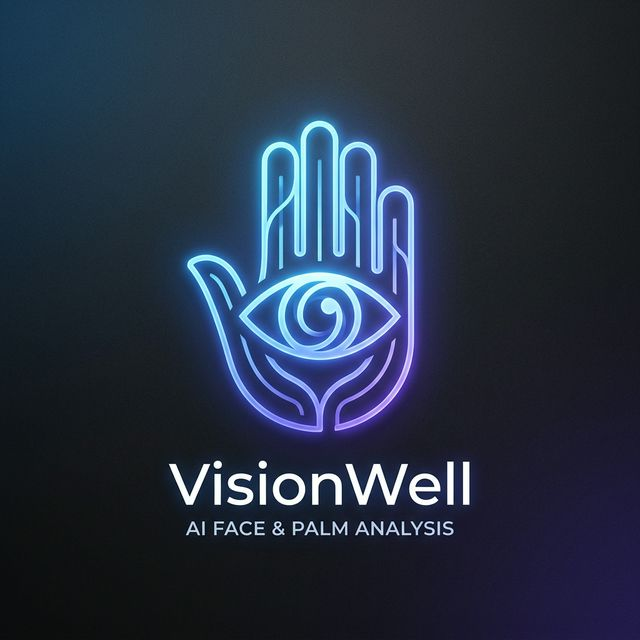

<div align="center">
  
  <h1>🔮 VisionWell AI: Insights for You</h1>
  <p><b>실시간 안면 및 손금 분석을 통한 AI 기반 퍼스널 웰니스 솔루션</b></p>

  [](https://share.streamlit.io/kidongin63-byte/Vision/main/streamlit_app.py)
  
  
  
</div>

---

## 🌟 프로젝트 개요
**VisionWell AI**는 최신 머신러닝 기술을 활용하여 사용자의 안면 특징(관상)과 손바닥 라인(수상)을 분석하는 인터랙티브 애플리케이션입니다.  
사용자에게 흥미롭고 가치 있는 성향적 통찰(Insights)을 제공하며, 현대적인 UI와 실시간 분석 성능을 자랑합니다.

## ✨ 주요 기능
- **🤖 인공지능 관상 분석 (Physiognomy)**: 안면 랜드마크 468개를 정밀 분석하여 초년, 중년, 말년 운세를 현대적으로 재해석합니다.
- **✋ 지능형 수상 분석 (Palmistry)**: 생명선, 두뇌선, 감정선, 운명선의 형태와 길이를 감지하여 타고난 기질과 향후 에너지를 분석합니다.
- **📊 실시간 감정 및 연령 예측**: DeepFace 엔진을 통한 미세 표정 감지로 현재의 감정 상태와 추정 나이를 실시간으로 제공합니다.
- **🌐 듀얼 플랫폼 지원**: 설치형 **데스크톱 앱(OpenCV)**과 웹 배포형 **Streamlit 대시보드**를 모두 갖춘 유연한 아키텍처입니다.

---

## 🚀 배포 가이드 (Deployment)

### [방법 1] Streamlit Cloud로 즉시 배포
아래 버튼을 눌러 자신의 GitHub 저장소를 연동하면 클릭 한 번으로 웹 배포가 가능합니다.
[](https://share.streamlit.io/deploy?repository=https://github.com/kidongin63-byte/Vision)

### [방법 2] 로컬 실행 (Local Setup)
```bash
# 1. 저장소 클론 및 이동
git clone https://github.com/kidongin63-byte/Vision.git && cd Vision

# 2. 필수 라이브러리 설치
pip install -r requirements.txt

# 3. 애플리케이션 구동
streamlit run streamlit_app.py
```

---

## 🛠️ 기술 스택 (Tech Stack)
- **Engine**: MediaPipe (Face Mesh, Hand Landmarker), DeepFace
- **Frontend/Dashboard**: Streamlit (Web), OpenCV (Desktop)
- **Processing**: NumPy, OpenCV, Pillow, TensorFlow (TF-Keras)
- **Deployment**: Streamlit Cloud, GitHub Actions

## ⚠️ 주의사항 (Legal Disclaimer)
본 소프트웨어는 **엔터테인먼트 및 라이프스타일 참고용**이며, 의학적 진단/법적 판단/신뢰할 수 있는 미래 예측을 목적으로 하지 않습니다. 결과는 환경(조명, 카메라 각도)에 따라 달라질 수 있습니다.

---
<div align="center">
  © 2026 <b>VisionWell Project Team</b>. All rights reserved.
</div>
